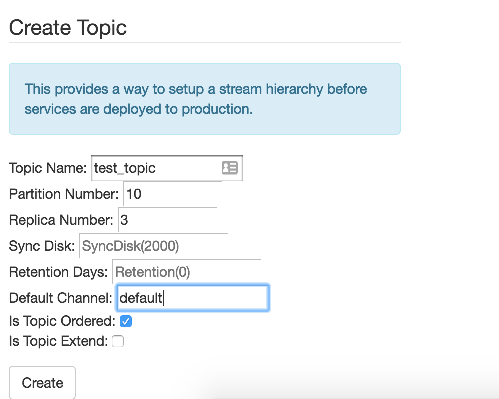

# 新版高级功能指南

## 顺序topic的使用指南
严格顺序消费需要生产方和消费方配合才能达到完全的顺序, 生产方需要指定一个顺序的字段, 比如订单id, 所有同一个订单的消息都必须单节点单线程按照顺序写入nsq, 消费业务则指定顺序消费即可, 可以多节点消费, 由服务端控制顺序推送.

### 顺序topic创建
首先在nsqadmin界面创建一个顺序topic, 具体分区数根据业务数据量决定, 对于一个每天200w消息量的topic, 建议10个分区左右



### 消息生产 (Golang, Java)
Golang示例

```Go
    topics := ["test_topic"]
    lookupAddress := "127.0.0.1:4161"
    config := nsq.NewConfig()
    // 启用顺序生产
	config.EnableOrdered = true
	// 默认pub返回的id, offset, rawSize数据无效, 当需要跟踪或者调试的时候, 可以开启
	// trace, 这时id, offset, rawSize会返回服务端写入的队列位置便于跟踪. 注意不要一直开启
	// 影响写入性能.
	// config.EnableTrace = true

    // 顺序生产的分区hash算法, 针对pub传入的sharding key做hash分区, 保证同样的订单id落到同一个分区保证顺序,
    // 并且保证不同的订单id, 均匀的分散到多个分区保证不同订单id的并发能力
	config.Hasher = murmur3.New32()
	pubMgr, err := nsq.NewTopicProducerMgr(topics, config)
	if err != nil {
		log.Printf("init error : %v", err)
		return
	}
	pubMgr.SetLogger(log.New(os.Stderr, "", log.LstdFlags), nsq.LogLevelInfo)
	err = pubMgr.ConnectToNSQLookupd(lookupAddress)
	if err != nil {
		log.Printf("lookup connect error : %v", err)
		return
	}
	var id nsq.NewMessageID
	var offset uint64
	var rawSize uint32
    // 生产顺序消息, orderID就是传入需要保证顺序的订单id, 注意必须保证相同的orderID不会产生并发写入, 否则生产的消息可能乱序, 此处可以用锁保护, 或者相同的订单id消息使用固定的线程.
	id, offset, rawSize, err = pubMgr.PublishOrdered(topic, orderID, msg)
```

### 消息消费
注意第一次使用的时候, 先启动消费者, 再启动生产者, 可以保证消费到所有消息(或者手动在nsqadmin先初始化创建channel), 否则只消费第一次启动之后生产的消息.

```Go
type consumeHandler struct {
	topic           string
}

func (c *consumeHandler) HandleMessage(message *nsq.Message) error {
	return nil
}

func main() {
    topic := "test_topic"
    channel := "order_sub"
    lookupAddress := "127.0.0.1:4161"
    config := nsq.NewConfig()
    // 启用顺序消费
    config.EnableOrdered = true
	config.Hasher = murmur3.New32()
	consumer, err := nsq.NewConsumer(topic, channel, config)
	if err != nil {
		panic(err.Error())
	}
    consumer.SetLogger(log.New(os.Stderr, "", log.LstdFlags), nsq.LogLevelInfo)
    // 注册并发消费处理函数
	consumer.AddConcurrentHandlers(&consumeHandler{topic}, 5)
	done := make(chan struct{})
	go func() {
        time.Sleep(time.Minute)
        // 消费完成后, 优雅停止消费
		consumer.Stop()
		<-consumer.StopChan
		close(done)
    }()
    // 连接lookup地址开始消费
	consumer.ConnectToNSQLookupd(lookupAddr)
    // 等待消费完成或者消费被停止
    <-done
}
```

注意对于非顺序的topic, 如果客户端开启了顺序消费, 也会被自动强制开始顺序消费, 此时如果要改回非顺序消费, 除了客户端需要改回非顺序消费外, 还需要手动调用服务端API给对应分区的所有nsqd节点才能生效:
```
POST /channel/setorder?order=false
```

## 消息跟踪id使用
消息跟踪id用于在排查问题时跟踪业务相关的信息, 比如传入订单id, 可以跟踪跟这个订单id相关的所有消息轨迹. 可以用于排查消息的生产, 以及什么时候被哪台机子消费的问题. 使用了跟踪id的消息会在服务端记录所有的轨迹log, 会对性能产生一定的影响, 注意使用开关来控制此功能的动态开启和关闭.

消息跟踪id, 只需要生产方写入跟踪id即可, 消费方无需任何修改.
示例:

```Go
func main() {
	config := nsq.NewConfig()
	// 打开会返回服务写入的位置信息, 也可以不开启, 只要pub写入了traceid, trace日志就会在服务端打印, 此开关不影响服务端日志
	config.EnableTrace = true
    topics := ["test_topic"]
	pubMgr, err := nsq.NewTopicProducerMgr(topics, config)
	if err != nil {
		log.Printf("init error : %v", err)
		return
	}
	pubMgr.SetLogger(log.New(os.Stderr, "", log.LstdFlags), nsq.LogLevelInfo)
	err = pubMgr.ConnectToNSQLookupd("127.0.0.1:4161")
	if err != nil {
		log.Printf("lookup connect error : %v", err)
		return
	}
	// 写入具体的traceid, 例如订单id, 如果要跟踪的不是整形的id, 可以先hash一个uint64再传入(可能有部分冲突, 但是不影响跟踪功能, 会跟踪到所有冲突的数据.) 
	// 当traceid>0时, trace日志就会在服务端打印
	orderID := uint64(12345)
	id, offset, rawSize, err = pubMgr.PublishAndTrace(topics[0], orderID, []byte("message body"))
	log.Printf("pub trace : %v, %v, %v", id, offset, rawSize)
	if err != nil {
		log.Printf("topic pub error : %v", err)
		return
	}

```
打开之后, 服务端会写入消息轨迹log, 默认是打到本地磁盘的, 可以配置把trace log打到远程collector, 然后由collector写入es, 这样就可以进行消息轨迹搜索了. 目前开源nsq并没有包含此搜索功能, 需要自行开发外部日志收集系统和日志搜索系统.

对于需要使用内部id搜索消息内容的情况, 可以nsqadmin配置中添加一个默认的 `trace_query_url = "http://127.0.0.1:1234/search"`, 就可以使用内部id直接搜消息了, 其他功能无效. 

## 延时消息使用指南

延时消息目前只支持消费延时, 只能在消费端控制延时的消息. 注意使用场景是少量需要重试的消息, 比如异常需要重试, 或者消费的下游业务系统超时, 或者需要一直重试直到成功的情况(比如信用卡还款这种). 消费业务方可以根据合适的延时策略做一些个性化的延时需求. NSQ的延时场景设计成非精确的, 因此只能保证尽量按照指定的延时投递, 可能会有误差, 特别是服务端较忙, 或者消费有积压的情况. 所以请注意务必不要依赖延迟的时间精度, 只依赖稍后消费语意. 注意顺序消费的topic不允许使用延时消费功能.

示例
```Go
type consumeHandler struct {
	topic           string
}

func (c *consumeHandler) HandleMessage(message *nsq.Message) error {
	now := time.Now().Unix()
	// 消息产生的时间
	produceTime := message.Timestamp
	var delayTs int64
	// 此处解析消息体, 获取消费时间数据, 判断是否延时, 如果需要延时计算延时时间, 计算结果存储到delayTS
	// ....
	//
	//
	if delayTs > now {
		// 消息延时时间还未到, 继续发送延时请求. 注意服务端可能推送的时间不准确, 如果未到时间, 需要下次收到时再次进行延时
		message.DisableAutoResponse()
		message.RequeueWithoutBackoff(time.Duration(delayTs-now) * time.Second)
	} else {
		log.Printf("message is processed: (id %v), at time : %v", message.ID, now)
		// 延时时间已到, 此处处理消息消费的业务逻辑
	}
	return nil
}

func main() {
    topic := "test_topic"
    channel := "sub"
    lookupAddress := "127.0.0.1:4161"
	config := nsq.NewConfig()
	// 配置最大允许的延时时间, 需小于服务端配置的最大值
	config.MaxRequeueDelay = time.Minute * 60
	consumer, err := nsq.NewConsumer(topic, channel, config)
	if err != nil {
		panic(err.Error())
	}
    consumer.SetLogger(log.New(os.Stderr, "", log.LstdFlags), nsq.LogLevelInfo)
    // 注册并发消费处理函数
	consumer.AddConcurrentHandlers(&consumeHandler{topic}, 5)
	done := make(chan struct{})
	go func() {
        time.Sleep(time.Minute)
        // 消费完成后, 优雅停止消费
		consumer.Stop()
		<-consumer.StopChan
		close(done)
    }()
    // 连接lookup地址开始消费
	consumer.ConnectToNSQLookupd(lookupAddr)
    // 等待消费完成或者消费被停止
    <-done
}

```

延迟消费精度不是很准的, 提高精度可以调整服务端的以下几个参数, cpu占用稍微高点
```
queue_scan_interval = "100ms"
queue_scan_selection_count = 100
queue_scan_worker_pool_max = 8
queue_scan_dirty_percent = 0.1
```
另外还有几个服务端参数可以控制延时消息的行为
```
req_to_end_threshold="10m"
max_req_timeout = "48h"
```
大部分情况下, 少量的req消息都是维护在服务端内存里面记录的. 对于req时间超过req_to_end_threshold的消息, 会进入单独的磁盘延时队列(此队列通过boltdb维护, 按照延时到期的时间排序), 其他情况下, 会根据当前req的消息是否会阻塞正常消费来判断是否要进入单独的磁盘延时队列. 比如重试次数超过一定次数并且积压超过一定时间或者数量, 或者内存重试的消息达到一定的量, 并且再次内存重试可能会阻塞磁盘正常消息消费. 

注意如果大量下发的消息都被req到之后进行处理(超过一半被req), 那么服务端会拒绝继续req操作, 认为客户端行为异常, 或者认为该消费消息依赖其他任务, 还没到消费时间. 此时服务端会等待客户端处理完之前没有处理的消息再继续下发新的消息, 客户端表现上看, 是消费被限速, 并且消息会被延迟投递.


## 扩展消息的使用指南
扩展消息可以在消息头部带上一些特定的业务扩展消息, 用于在不影响具体业务消费逻辑的情况下, 控制一些通用的行为, 比如做消息类型判断, 过滤消息等.
### 扩展topic创建
首先需要创建一个支持扩展的消息, 在nsqadmin创建时务必选中`Is Topic Extend`选项.

### 扩展字段类型
目前仅支持json简单kv类型的数据扩展, 以后可能会有其他扩展类型, 其中json扩展的前缀带上`##`的key是内部保留key, 业务自定义的kv不要使用`##`做前缀

### 扩展字段写入

```Go
func main() {
	config := nsq.NewConfig()
    topics := ["test_topic"]
	pubMgr, err := nsq.NewTopicProducerMgr(topics, config)
	if err != nil {
		log.Printf("init error : %v", err)
		return
	}
	pubMgr.SetLogger(log.New(os.Stderr, "", log.LstdFlags), nsq.LogLevelInfo)
	err = pubMgr.ConnectToNSQLookupd("127.0.0.1:4161")
	if err != nil {
		log.Printf("lookup connect error : %v", err)
		return
	}
	var jext nsq.MsgExt
	jext.Custom = make(map[string]string)
	jext.Custom["extk"] = "extvalue"
	_, _, _, err = pubMgr.PublishWithJsonExt(topics[0], []byte("message body"), &jext)
	if err != nil {
		log.Printf("topic pub error : %v", err)
		return
	}
```
如果返回错误, 请确认topic创建时选中了扩展支持功能.

### 消费消息的扩展字段
一般来说, 业务方本身不需要针对扩展数据进行处理, 而是由服务端或者框架层做处理, 避免不同业务做相同的处理逻辑. 消费方扩展数据存放在收到的message里面的`ExtVer`,  `ExtBytes`字段, 可以使用`GetJsonExt()`获取json扩展对象.

## 消费过滤示例

## 分区个数创建的建议
非顺序的topic, 由于支持同一个partition进行多个并发消费, 因此无需过多的partitions, 只需保证写入性能满足需求即可, 另外为了保持和原版nsq兼容, 每个节点只能有一个分区, 因此分区数*副本数不能大于节点总数. 非顺序的topic可以动态扩建分区不影响业务使用. 建议普通topic使用 2分区2副本, 业务数据很多, 但是不怎么重要的, 比如log数据, 可以使用4分区1副本, 对于数据要求很高的, 可以使用2分区3副本(需要6台机器集群).

对于顺序的topic, 分区数取决于消费能力, 如果需要更高的并发度, 可以优化消费业务的消费能力, 如果消费能力已经无法优化, 则需要更多的分区数提高并发能力. 大部分情况下16个分区可以满足大部分需求, 如果吞吐量很大, 还需要实际计算消费业务的延迟来决定. 由于顺序消费topic在动态扩建topic时会导致无序消息, 因此需要规划一个较长时间的潜在能力.
## 一些消费配置的建议


max_inflight: 允许当前消费处理的消息总数, 此值包括所有并发的待ack的消息数量, 如果超过, 则会暂时停止接收消息, 直到消息被逐渐消费完成. 建议设置成并发消费数*2, 此值在go sdk中用来自动调整ready值.

ready: 消费能力值, 根据消费能力调整, 一般使用默认值. sdk会根据消费能力动态调整, 只需设置max_inflight即可. 对于其他语言sdk可以根据需要调整, 对于非批量消费的业务而言, 一般建议对于每个连接平均值小于10. 对于批量任务的消费, 可以适当调整到和批量任务消费相匹配的消费能力.

max_attempt: 每条消息的最大重试消费次数, 注意重试可能包括网络异常, 主备切换, 业务异常等, 实际业务消费次数可能小于此重试次数. 因此设置时建议加上一个余量. 对于一般业务可以使用默认值, 重要的业务, 或者可能需要多次重试的业务, 建议配置一个较大的次数(>100以上).

msg_timeout: 根据业务消费一条消息的时间来调整, 如果消息里面有批量的任务, 需要适当调大消费超时, 一般使用默认值, 如果特别耗时的业务, 最大可以调整到15分钟. 建议配合touch来使用.

并发消费数: 可能根据不同的业务类型需要调整, 对于go这种轻量型的goroutine而言, 如果是计算类型的业务, 建议设置为机器的CPU数*4, 如果是io类型的业务建议设置CPU数*32以上. 如果是Java线程, 建议适当调小一些. 

其他值可以保持默认值

## 常见错误信息排查
