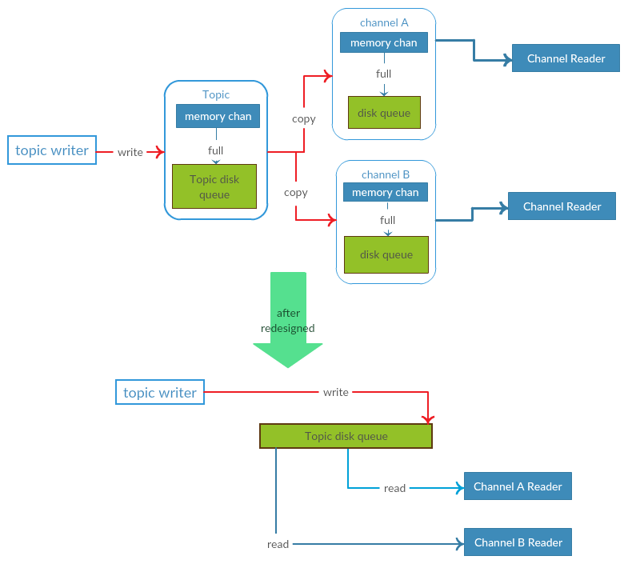
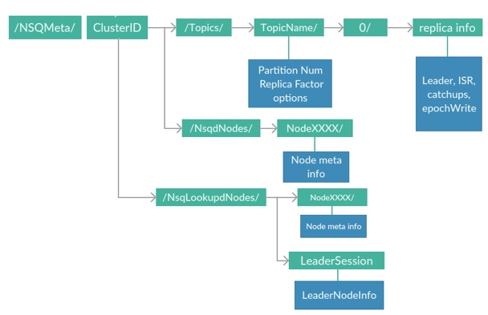
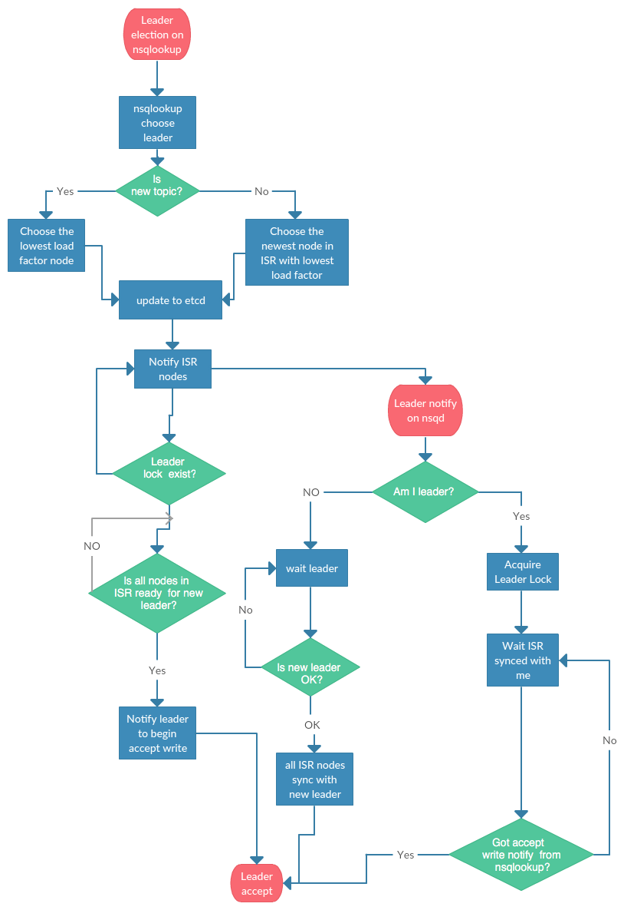
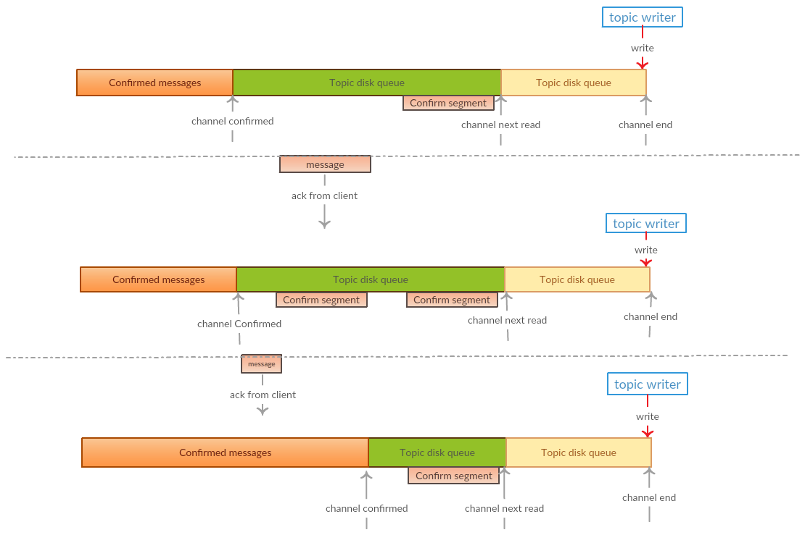
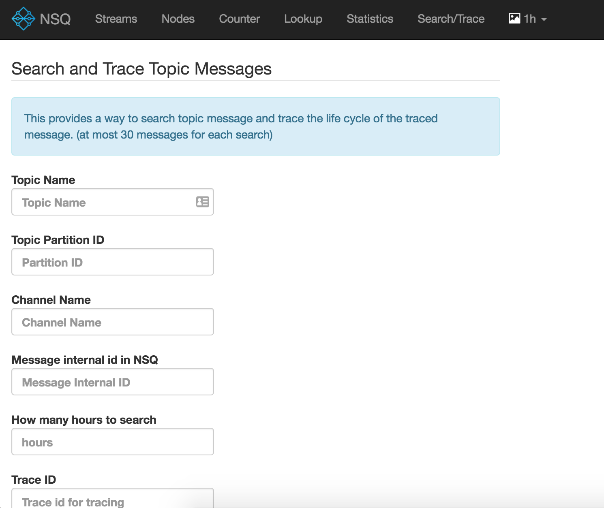

# NSQ重塑之详细设计细节

之前的[文章](https://tech.youzan.com/how-we-redesign-the-nsq-overview)讲述了我们重塑NSQ的目的和目标, 接下来我们将详细描述下每个功能的具体技术细节.

## 重构后架构图
首先, 再回顾下重构后的整体架构图:


原来的几个NSQ组件大部分功能是复用的, 图中新增的就是元数据存储服务-etcd, 以及数据同步和HA处理逻辑. 下面我们按照我们的改造流程一一披露具体的技术细节.

## 改造topic queue
为了增加副本和其他特性, 首先需要改造的就是nsq的topic数据写入方式, 要保证数据最终落盘, 才能继续后面的改造. 所以我们第一步重构数据写入逻辑, 这块逻辑本身并不依赖分布式功能, 可以独立重构.

### 数据落盘
原版的topic写入流程是通过golang里面的chan来做的, 只有超过chan容量之后, 才会落盘. 但是chan有几个缺点, 首先是内存数据, 数据会丢, 其次是只能两端操作, 无法做更多丰富的查询操作. 因此chan本身作为数据存储方案对于持久化数据是不太合适的. 改造这块的逻辑还是比较简单的, 只要把原来写chan满之后的数据才落盘的逻辑直接改成任何数据都落盘即可. 

但是这样修改之后, 第一是由于IO操作比内存耗时, 导致写入速度不理想; 第二是需要处理channel和topic的数据关系问题, 每个channel的消费数据是独立的, 原来处理方式是把所有数据复制一份到每个channel, 如果还是按这种方式处理, 会导致所有channel的数据需要再次操作数据写入磁盘, 无疑会带来更大的性能损失.为了避免落盘改造带来的性能下降, 我们做了更多工作来优化写入性能.

### 消费channel的数据同步处理
以前的方式之所以要从topic复制所有消息到每个channel, 是因为使用的是golang里面的chan这种机制, 只有复制才能保证每个消费组的数据互相独立. 当所有数据落盘之后, 我们其实不需要再做这种数据复制的操作了, 只需要记录每个channel已经同步的数据位移和每个channel的消费位移即可. 这样所有的channel引用的是同一份topic磁盘数据, 每个channel维护自己的独立位移信息即可. 节省了数据复制的操作, 提高了性能, 也保证了各个channel之间的独立性. 从流程上看, 改造后我们把topic的写入和读取流程分离开了, topic本身只负责写入数据, channel仅负责读取数据.



### 组提交和刷盘调度优化
topic到channel之间的数据复制步骤去掉之后, 已经带来了较大的性能提升. 接着我们继续优化topic本身的写入优化. 

首先, 在服务端引入常见的Group commit组提交方式, 将多个消息一次性提交, 减少IO操作. 这样不管是因为刷盘还是因为数据副本同步的延迟, 都会把这段时间的积累的多个消息作为一组一次性写入. 这样就大大减少了需要操作的写入次数. 这种服务端group commit的方式往往比Kafka客户端批量写入的方式会表现更好, 因为实际场景下, 往往单个客户端的写入并没有那么大, 而是分散到非常多的客户端机器上面了. 而服务端group commit处理可以更好的优化这种场景. 具体代码如下:

```Go
// client async pub
// 客户端pub的数据写入临时chan后, 在chan上面等待结果异步返回
func internalPubAsync(clientTimer *time.Timer, msgBody *bytes.Buffer, topic *nsqd.Topic) error {
  ...
	info := &nsqd.PubInfo{
		Done:       make(chan struct{}),
		MsgBody:    msgBody,
		StartPub:   time.Now(),
	}
	if clientTimer == nil {
		clientTimer = time.NewTimer(time.Second * 5)
	} else {
		clientTimer.Reset(time.Second * 5)
	}
	select {
	case topic.GetWaitChan() <- info:
	default:
		select {
		case topic.GetWaitChan() <- info:
		case <-topic.QuitChan():
			nsqd.NsqLogger().Infof("topic %v put messages failed at exiting", topic.GetFullName())
			return nsqd.ErrExiting
		case <-clientTimer.C:
			nsqd.NsqLogger().Infof("topic %v put messages timeout ", topic.GetFullName())
			return ErrPubToWaitTimeout
		}
	}
	<-info.Done
	return info.Err
}

// group commit loop
// 组提交循环, 在chan上面等待异步提交写入请求, 并尝试一次提交所有等待中的请求,
// 请求完成后, 通过关闭对应请求的chan来通知客户端结果.
func (c *context) internalPubLoop(topic *nsqd.Topic) {
	messages := make([]*nsqd.Message, 0, 100)
	pubInfoList := make([]*nsqd.PubInfo, 0, 100)
	topicName := topic.GetTopicName()
	partition := topic.GetTopicPart()
	defer func() {
		done := false
		for !done {
			select {
			case info := <-topic.GetWaitChan():
				pubInfoList = append(pubInfoList, info)
			default:
				done = true
			}
		}
		for _, info := range pubInfoList {
			info.Err = nsqd.ErrExiting
			close(info.Done)
		}
	}()
	quitChan := topic.QuitChan()
	infoChan := topic.GetWaitChan()
	for {
		select {
		case <-quitChan:
			return
		case info := <-infoChan:
			if info.MsgBody.Len() <= 0 {
				nsqd.NsqLogger().Logf("empty msg body")
			}
			
			messages = append(messages, nsqd.NewMessage(0, info.MsgBody.Bytes()))
			pubInfoList = append(pubInfoList, info)

		default:
			if len(pubInfoList) == 0 {
				select {
				case <-quitChan:
					return
				case info := <-infoChan:
					messages = append(messages, nsqd.NewMessage(0, info.MsgBody.Bytes()))
					pubInfoList = append(pubInfoList, info)
				}
				continue
			}
			var retErr error
			if c.checkForMasterWrite(topicName, partition) {
				_, _, _, err := c.PutMessages(topic, messages)
				if err != nil {
					nsqd.NsqLogger().LogErrorf("topic %v put messages %v failed: %v", topic.GetFullName(), len(messages), err)
					retErr = err
				}
			} else {
				topic.DisableForSlave()
				nsqd.NsqLogger().LogDebugf("should put to master: %v",
					topic.GetFullName())
				retErr = consistence.ErrNotTopicLeader.ToErrorType()
			}
			for _, info := range pubInfoList {
				info.Err = retErr
				close(info.Done)
			}
			pubInfoList = pubInfoList[:0]
			messages = messages[:0]
		}
	}
}
```

其次, 针对不同的topic可以支持不同的刷盘策略, 灵活适配不同业务的刷盘需求. 在创建topic的时候, 可以指定每写入多少条消息刷盘一次, 这样每个业务由于写入的频率不同, 把刷盘的请求打散了, 避免一次性过多的刷盘请求阻塞正常写入. 另外, 还有一个后台goroutine会在每隔固定时间选择一部分topic分区强制刷盘, 保证数据及时落盘.


## 改造支持数据副本和HA

topic写入落盘改造之后, 再来看看如何增加数据副本和HA特性. 整体流程可以参考架构图, 做了类似Kafka的设计, 将每个topic的数据节点副本元信息写入etcd, 然后通过etcd选举出每个topic的leader节点. 选举的topic的leader节点负责自己topic的数据副本同步, 其他follower节点从leader节点同步topic数据.

### 元数据存储
一些少量的元数据存储在etcd, 保证整个集群的元数据的一致性. 具体包括每个topic的配置信息, 副本节点的分布, 选举出来的leader节点信息, nsqd数据节点的配置信息以及nsqlookupd数据查询节点的配置信息. 元数据树结构图如下:



由于元数据数据量很少, 变更也非常少, 因此本身对etcd的性能并没有什么要求. 另外nsqd数据节点和nsqlookupd查询节点的保活也通过etcd来做. 

### leader选举和HA

改造后的nsq架构, 每个topic需要一个leader节点负责处理读写请求和数据同步. 为了保证每个节点的负载趋于均衡, 我们通过nsqlookupd来选择合适的topic的leader节点, 并通知给所有副本进行leader确认. leader节点会尝试从etcd获取topic对应的leader锁确认leader有效.

当某个节点失效时, 会触发etcd的watch事件, 从而触发nsqlookupd重新选择其他存活的节点作为topic的新leader, 完成leader的快速切换. 客户端如果此时正在写入老的leader也会触发失败重试, 并获取最新的leader节点, 完成自动HA.
选举具体流程如下:



### 数据副本同步和动态ISR

每个topic选举出来的leader节点负责同步数据到所有副本. 为了支持副本节点的动态变化, 参考了Kafka的ISR(In synced replica)的设计. 和Kafka不同的是, 我们用push模式, 不是pull的模式, 来保证数据的同步复制, 避免数据同步不一致. 因此, 数据写入首先由leader节点发起, 并且同步到所有ISR副本节点成功后, 才返回给客户端. 如果同步ISR节点失败, 则尝试动态调整ISR并重试直到成功为止. 重试的过程中会检查leader的有效性, 以及是否重复提交等条件. 写入流程和ISR的动态调整流程如图所示:


通过动态ISR的调整, 可以保证失效的节点及时从ISR中清理掉, 从而减少失效节点对数据副本同步性能的影响.

数据同步落后的节点会从ISR移动到Catchup列表中, Catchup列表中的节点会自动尝试追上leader的数据日志, 追上后会通知leader进行ISR节点加入验证的流程.

不管是leader同步复制数据到ISR节点列表, 还是catchup节点从leader拉取同步数据, 都是通过一个commitlog来维护本地数据的同步情况. commitlog维护的是每次写请求的自增id, 以及该写入请求对应于topic的磁盘队列文件的位置和数据大小, 有了commitlog, 我们就可以判断每个副本的同步状态, 以及下次需要从哪里开始同步数据, 也可以判断写入请求是否是重复的已提交请求. 在leader选举时以及加入新的ISR节点时也会判断commitlog是否已经完全同步.

数据副本的配置支持topic级别的, 因此可以在一个集群里面对不同的topic配置不同的副本数, 来满足不同的业务需求, 另外topic级别的配置隔离也会更方便对后面更多的特性进行隔离. 使得不同的业务topic可以使用不同的特性配置.

### 自动数据平衡

由于所有的topic都是leader负责处理客户端的pub和sub请求, 因此为了保证各个节点的负载均衡, 我们实现了自动根据负载做数据平衡的功能. 通过自动平衡功能也可以实现在缩容或者扩容时, 自动的将数据迁移到其他机器上.

数据平衡是nsqlookupd通过定期收集各个nsqd数据节点的负载信息, 包括CPU, 数据写入量, topic的数量等信息, 给每个nsqd的负载算出一个load值, 然后使用动态ISR流程, 调整topic的ISR节点分布, 使得各个nsqd的节点的load的差距在合理范围内. 为了避免迁移影响正常服务, 可以配置允许数据平衡的时间范围.

原版NSQ的pub都是在生产者配置文件中的配置部分nsqd节点, 然后从中随机选择可用的nsqd节点进行发消息, 只有消费者需要从nsqlookupd查找哪些节点存储了对应的topic数据, 然后从所有的存储节点进行消费. 这样不利于控制生产者的数据写入. 改造后的NSQ集群通过nsqlookupd动态的调整每个topic的数据分布, 使得每个topic被限制在一部分nsqd节点上面. 这样生产和消费都在nsqlookupd的控制之下, 防止topic过于分散. 并且生产者也不需要动态的配置可用的nsqd节点, 只需查询nsqlookupd去获取当前topic可用的nsqd节点.

### 分区支持

由于引入了leader, 原来可以随便选择nsqd节点进行读写的方式需要选择leader进行读写, 这样会导致可以读写的节点变少, 为了提高读写的可扩展性, 对topic引入分区的概念, 每个topic可以指定多个分区, 每个分区使用独立的leader节点, 这样保证每个topic可以有多个可以读写的分区节点.

## 改造消费channel

topic改造之后, channel本身不会存储消息数据了, 因此需要对原来某些消费特性做相应的处理, 同时也更方便引入新的消费特性.

### 处理消费cursor

每个消费channel维护的cursor会包含当前已经消费确认的文件位置(channel confirmed), 以及下一条消息读取的文件位置(channel next read), channel的下一条读取位置和已经消费确认位置之间的差值, 就是当前正在等待确认ack的消息.

每次投递消息给客户端时会从channel next read位置读取下一条消息到内存并更新channel next read, 如果有多个客户端连接则会读取多条分别投递给多个客户端, 当客户端ack某条消息时, 会根据这条消息的位置信息判断是否需要移动已确认的消费位置. 如果该条消息的起点位置和channel confirmed位置重合时, 则更新channel confimed信息. 

可以看到, 当消息乱序到来时, 已确认消费位置的游标channel confirmed, 只能移动到目前连续的最小位置, 如果不是连续的, 则需要临时记录已经确认的所有非连续段的首尾位置作为一个confirmed segment, 每次ack一条消息会判断是否可以和现有的confirmed segment合并成一个大的segment. cursor处理过程如下图所示:



正常情况下, 非连续的confirmed segment会异步复制到副本节点上, 当leader失效时, 副本节点也可以知道哪些非连续段是已经被确认的消息, 尽量减少重复投递. 不过异步同步如果异常, 并且节点重启, 内存中的confirmed segment可能会丢失, channel next read会被重置到channel confirmed位置, 因此会出现部分的消息重复投递. 为了保证at-least-once的投递目的, 我们需要容忍某些异常情况下的重复消息.

### 处理重试和延时消费

可以看到, 改造后的channel可能会出现某些情况下待确认消息窗口过大的问题, 这样会导致内存中维护的confirmed segment过多, 内存可能占用过多的问题. 特别是当某些消息一直在重试时或者延时处理时, 会加剧这种情况. 为了避免这种多次重试或者延时消费的消息影响正常的数据消费, 我们为每个channel增加了一个异常延时队列, 保证这些消息和正常的消息消费进行一定程度的隔离. 

正常情况下, 以及少量的重试时, 会一直在内存中维护这些待确认的消息对象, 一旦有多次异常的消息, 或者延时时间较长的消息时, 我们将此类消息自动从内存中移动到延时队列中, 然后继续投递后面正常的消息. 对于延时队列中的消息, 我们会定时的从队列中读出来进行重试. 由于延时队列是存储在boltdb的, 因此可以使用更少的内存处理大量的这种异常或者延时消息, 虽然boltdb的写入性能不佳, 但是我们这里只用来存储异常消息, 因此这种异常情况下的性能完全可以满足. 通过引入磁盘延时队列, 改造后的channel在不影响正常消息的情况下可以允许更多的重试以及更长的延时消息, 相比于之前延时1小时的上限, 可以增加延时上限到几天.

### 消费数据预读优化

为了更进一步的优化消费性能, 减少读IO, 在channel读取消息进行投递的时候, 会自动读取更多的数据放在buffer里面, 下次直接读取buffer即可, 直到buffer数据读完之后, 再进行预读下一部分数据, 通过预读优化, 大大减少了磁盘随机读IO, 也减少了读文件的系统调用次数, 也会顺便减少golang对于这种系统调用的切换开销. 

### 重放历史数据

由于改造之后的所有channel都是使用cursor来引用实际的磁盘文件的, 因此重放历史数据进行消费这种特性就变得十分简单了. 只需将cursor重新定位到历史消息的位置即可. 而历史消息的位置可以借助commitlog进行搜索来定位. 可以支持按照时间或者按照消息队列的某个位置开始重放.

### 严格顺序消费

默认的消费模式, 是允许多个客户端链接同时消费topic下的同一个分区的不同消息的, 这样可以使用最小的分区数来达到较高的并发消费能力, 避免了像Kafka那样为了提高消费能力, 创建过多的分区, 也就避免了过多分区数带来的磁盘随机IO问题, 但是也由此带来乱序投递的问题. 实际场景中某些业务需要保证消息严格按照生产写入的顺序进行投递, 这种情况我们就需要在服务端控制投递的策略了.

对于业务的这种场景, 我们引入了顺序投递的特性. 并在生产方也支持按照业务定制id进行分区hash的生产能力, 从而保证从生产到消费整条链路是按照分区内有序的方式进行消息流转的. 消息生产方会根据业务的分区id将同样的id投递到同一个topic分区, 保证相同id的数据的顺序一致性, 而在投递时, 会调整并发消费策略, 保证同一时刻只会投递一条消息进行消费, 等待上一次ack成功后才继续投递下一条消息. 同时, 为了避免leader切换时影响消息的顺序性, ack的消息还会同步到所有副本才算成功.

可以看到这种方式单个分区的消费并发能力较弱, 主要取决于消费业务的处理能力, 为了提高更高的顺序消费并发能力, 需要更多的分区数. 分区数的计算可以根据每条消息的处理时间和每秒的消息数来计算: 分区数=每秒消息条数*每条消息的处理时间(单位s).

## 消息轨迹查询系统

之前的NSQ系统由于消息在chan里面流转一遍就没了, 很难事后进行数据追查, 也没有一个很好的方式去跟踪一条消息在从生产到被消费的各种中间状态. 为了满足业务方时不时的来排查业务消息状态的需求, 我们改造后的NSQ也支持动态的开启这种消息轨迹排查功能. 为了支持消息轨迹查询, 我们做了如下几个工作:

- 能通过消息id定位到磁盘上的消息内容
- 支持传入业务traceid, 并将业务traceid和nsq的消息id关联起来
- 记录一条消息的所有中间态变化信息
- 将消息的状态变迁信息同步到ES搜索系统
- nsqadmin提供方便的统一查询入口
- 支持针对topic和channel级别的动态跟踪开关以减少资源消耗

通过这一套轨迹查询系统, 在业务方需要排查问题的时候, 就能非常快速的找到异常消息的轨迹从而快速的定位业务问题了. 特别是在排查顺序消费的业务场景时, 经常能发现业务潜在的并发误用问题.




## 引入Jepsen分布式测试的支持

由于此次改造变动非常大, 引入了更多的复杂性, 为了确保我们的分布式改造满足预期的效果, 我们做了大量的异常测试, 当然也引入了业界流行的自动化分布式测试工具Jepsen. 在各种异常测试过程中也发现了一些普通情况下非常难以发现的问题. 通过Jepsen测试之后, 我们也对改造后的系统更有信心了, 即使后面做更多改造也可以更加放心了.

下面是nsq跑的一部分jepsen测试场景

```Clojure
(deftest nsq-test
  (let [test (jepsen/run!
               (assoc
                 noop-test
                 :name       "nsq-simple-partition"
                 :os         debian/os
                 :db         db
                 :client     (queue-client)
                 :nemesis    (nemesis/partition-random-halves)
                 :model      (model/unordered-queue)
                 :checker    (checker/compose
                               {:total-queue checker/total-queue})
                 :generator  (gen/phases
                               (->> (gen/queue)
                                    (gen/delay 1/10)
                                    (gen/nemesis
                                      (gen/seq
                                        (cycle [(gen/sleep 30)
                                                {:type :info :f :start}
                                                (gen/sleep 60)
                                                {:type :info :f :stop}])))
                                    (gen/time-limit 360))
                               (gen/nemesis
                                 (gen/once {:type :info, :f :stop}))
                               (gen/log "waiting for recovery")
                               (gen/sleep 60)
                               (gen/clients
                                 (gen/each
                                   (gen/once {:type :invoke
                                              :f    :drain}))))))]
    (is (:valid? (:results test)))
    (report/to "report/queue.txt"
               (-> test :results pprint))))

```

整个测试流程就是通过jepsen控制节点, 随机的断开集群里面的某些节点的网络, 持续一段时间然后恢复, 如此反复操作几次. 在这些断网过程中, 有多个客户端不停的进行pub和sub操作并记录所有的操作记录, 最后再对所有的消息进行对比, 判断是否有任何pub成功的消息没有被消费到, 以及重复的消息统计等. 通过对比结果就可以知道是否通过了jepsen测试的检验. 有了jepsen自动测试, 我们会在每次新版本发布前跑多次jepsen测试脚本, 确保没有引入新的分布式问题.

## 总结

改造的过程中还特别需要注意和老版本的客户端的兼容性, 以减少客户端的迁移改造成本. 除了以上几个大的改造点, 还有很多小的改造细节, 感兴趣的可以去研究下我们的开源代码 [NSQ](https://github.com/youzan/nsq)

接下来我们还会有一篇文章讲述我们正在添加的新功能以及接下来的计划, 包括各种sink, connector, 消息过滤, 扩展消息, 事务消息设计等等, 后面更多新的特性也会在将来不断的补充和完善起来, 敬请期待, 也欢迎有志之士踊跃参与NSQ的开源改进计划.