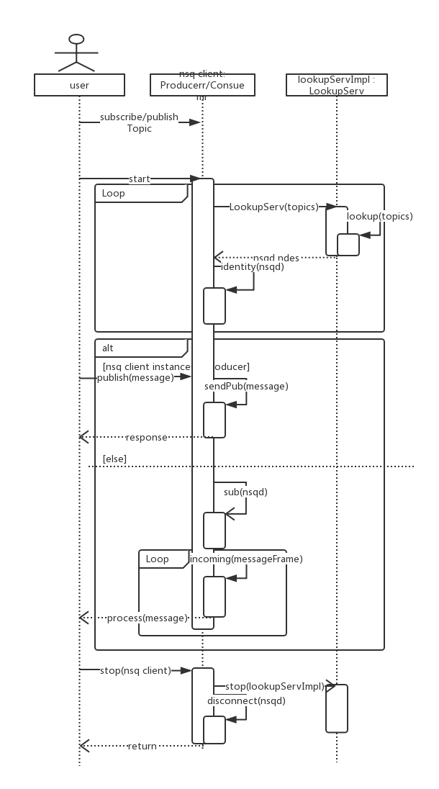
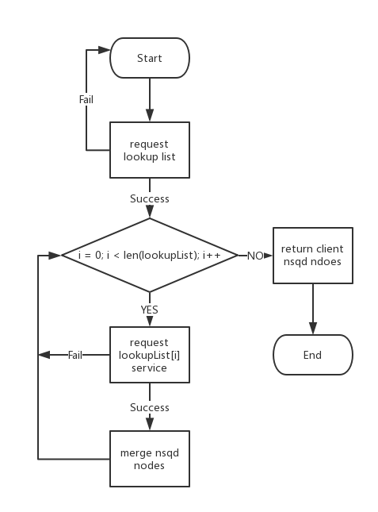

##overview
有赞的自研版NSQ在高可用性以及负载均衡方面进行了改造，自研版的nsqd中引入了数据分区以及副本，副本保存在不同的nsqd上，达到容灾目的。此外，自研版NSQ在原有Protocol Spec基础上进行了拓展，支持基于分区的消息生产、消费，以及基于消息分区的有序消费，以及消息追踪功能。

为了充分支持自研版NSQ新功能，在要构建NSQ client时，需要在兼容原版NSQ的基础上，实现额外的设计。本文作为[《Building Client Libraries》](http://nsq.io/clients/building_client_libraries.html)的拓展，为构建有赞自研版NSQ client提供指引。

参考NSQ官方的构造client指南的结构，接下来的文章分为如下部分：

1 workflow及配置
2 nsqd发现服务
3 nsqd建连
4 发送/接收消息
5 顺序消费
>本文根据有赞自研版nsq的新特性，对nsq文档[^1]中构建nsq client的专题进行补充。在阅读[《Building Client Libraries》](http://nsq.io/clients/building_client_libraries.html)的基础上阅读本文，更有助于理解。
##workflow及配置
通过一张图，浏览一下nsq client的工作流程。

 

client作为消息producer或者consumer启动后，负责lookup的功能通过nsqlookupd进行nsqd服务发现。对于服务发现返回的nsqd节点，client进行建连操作以及异常处理。nsq连接建立后，producer进行消息发送，consumer则监听端口接收消息。同时，client负责响应来自nsqd的心跳，以保持连接不被断开。在和nsqd消息通信过程中，client通过lookup发现，持续更新nsq集群中topic以及节点最新信息，并对连接做相应更新操作。当消息发送/消费结束时，client负责关闭相应nsqd连接。文章在接下来讨论这一流程中的关键步骤，对相应功能的实现做更详细的说明。
###配置client
自研版NSQ改造自开源版NSQ，继承了开源版NSQ中的配置。[^1]中Configuration段落的内容适用于有赞自研版。唯一需要指出的地方是，开源版nsq将使用nsqlookupd作为nsqd服务发现的一个可选项，基于配置灵活性的考量，开源版NSQ允许client通过nsqd的地址直接建立连接，自研版NSQ由于支持动态负载，nsqd之间的主从关系在集群中发生切换的时候，需要依赖自研版的nsqlookupd将变更信息反馈给nsq client。基于此，使用nsqlookupd进行服务发现，在自研版NSQ中是一个“标配”。我们也将在下一节中对服务发现过程做详细的说明。

##nsqd发现服务
开源版中，提供nsqd发现服务作为nsqlookupd的重要功能，用于向消息的consumer/producer提供可消费/生产的nsqd节点。上文提到，区别于开源版本，自研版的nsqlookupd将作为服务发现的唯一入口。nsq client负责调用nsqlookupd的lookup服务，并通过poll，定时更新消息在nsq集群上的读写分布信息。根据lookup返回的结果，nsq client对nsqd进行建连。自研NSQ中可以建立多个nsqlookupd，其中有一个master，其余为slave。

在自研版中访问lookup服务的方式和开源版一样简单直接，向nsqlookupd的http端口 GET：/lookup?topic={topic_name} 即可完成。不同之处在于，自研版本NSQ的lookup服务中支持两种新的查询参数：
>GET：/lookup?topic={topic_name}&access={r or w}&metainto=true

其中：access用于区分nsq client的生产/消费请求。代表producer的lookup查询中的参数为access=w，consumer的lookup查询为access=r。metainfo参数用于提示nsqlookup是否返回查询topic的分区元数据，包括查询topic的分区总数，以及副本个数。顺序消费时，prodcuer通过返回的分区元数据来判断lookup响应中返回的分区数是否完整，顺序消费和生产的详细部分我们将在发送消息章节中讨论。client在访问lookup服务时，根据prodcuer&consumer角色的差别可以使用两类查询参数

* Producer GET:/lookup?topic=test&access=w&metainfo=true
* Consumer GET:/lookup?topic=test&access=r

在设计上，由于metainfo提供的信息是为producer在顺序消费场景下的生产，为了减少nsqlookupd服务压力，代表consumer的lookup查询无需携带metainfo参数。自研版lookup的响应和开原版本兼容：
<pre>
{
    "status_code":200,
    "status_txt":"OK",
    "data":{
        "channels":[
            "BaseConsumer"
        ],
        "meta":{
            "partition_num":1,
            "replica":1
        },
        "partitions":{
            "0":{
                "id":"10.9.52.215:33122",
                "remote_address":"10.9.52.215:33122",
                "hostname":"qabb-qa-sqs4",
                "broadcast_address":"10.9.52.215",
                "tcp_port":4150,
                "http_port":4151,
                "version":"0.3.7-HA.1.5.4.1",
                "distributed_id":"10.9.52.215:4250:4150:338437"
            }
        },
        "producers":[
            {
                "id":"10.9.52.215:33122",
                "remote_address":"10.9.52.215:33122",
                "hostname":"qabb-qa-sqs4",
                "broadcast_address":"10.9.52.215",
                "tcp_port":4150,
                "http_port":4151,
                "version":"0.3.7-HA.1.5.4.1",
                "distributed_id":"10.9.52.215:4250:4150:338437"
            }
        ]
    }
}
</pre>

###lookup流程
client的lookup流程如下：
) 

自研版nsqlookupd添加了listlookup服务，用于发现接入集群中的nsqlookupd。nsq client通过访问一个已配置的nsqlookupd地址，发现所有nsqlookupd。获得nsqlookupd后，nsq client遍历得到的nsqlookupd地址，进行lookup节点发现。nsq client合并遍历获得的节点信息并返回。nsq client在访问listlookup以及lookup服务失败的场景下（如，访问超时），nsq client可以尝试重试。lookup超过最大重试次数后依然失败的情况，nsq client可以降低访问该nsqlookupd的优先级。client定期查询lookup，保证client更新连接到有效的nsqd。
##nsqd建连
自研版nsqd在建连时遵照[^1]中描述的建连步骤，通过lookup返回结果中partitions字段中的{broadcast_address}:{tcp_port}建立TCP连接。自研版中，一个独立的TCP连接对应一个topic的一个分区。consumer在建连的时候需要建立与分区数量对应的TCP连接，以接收到所有的分区中的消息。client的基本建连过程依然遵守[^1]中的4步:

* client发送magic标志
* client发送 an IDENTIFY command 并处理返回结果
* client发送 SUB command (指定目标的topic以及分区)， 并处理返回结果
* client发送 RDY 命令

client通过自研版NSQ中拓展的SUB命令，连接到指定topic的指定分区。
<pre>
SUB &lt;topic&gt; &lt;channel_name&gt; &lt;topic_partition&gt; \n
topic_name -- 消费的topic名称
topic_partition -- topic的合法分区名
channel_name -- channel
</pre>
Response:
<pre>
OK
</pre>
Error response:
<pre>
E_INVALID
E_BAD_TOPIC
E_BAD_CHANNEL
E_SUB_ORDER_IS_MUST  当前topic只支持顺序消费
</pre>
client在建连过程中，向lookup返回的每一个nsqd partition发送该命令。SUB命令的出错响应中，自研版本NSQ中加入了最后一个错误代码，当client SUB一个配置为顺序消费的topic时，client会收到该错误。相应的携带分区号的PUB命令格式为：
<pre>
PUB &lt;topic_name&gt; &lt;topic_partition&gt;\n
[ 4-byte size in bytes ][ N-byte binary data ]

topic -- 合法topic名称
partitionId -- 合法分区名
</pre>
Response:
<pre>
OK
</pre>
Error response:
<pre>
E_INVALID
E_BAD_TOPIC
E_BAD_MESSAGE
E_PUB_FAILED
E_FAILED_ON_NOT_LEADER    当前尝试写入的nsqd节点在副本中不是leader
E_FAILED_ON_NOT_WRITABLE  当前的nqd节点禁止写入消息
E_TOPIC_NOT_EXIST         向当前连接中写入不存在的topic消息
</pre>
自研版本NSQ中加入了最后三个错误代码，分别用于提示当前尝试写入的nsqd节点在副本中不是leader，以及当前的nqd节点禁止写入。client在接收到错误的时候，应该直接关闭TCP连接，等待lookup定时查询更新nsqd节点信息，或者立刻发起lookup查询。如果没有传入partition id, 服务端会选择默认的partition. 客户端可以选择topic的partition发送算法，可以根据负载情况选择一个partition发送，也可以固定的Key发送到固定的partition。client在消费时，可以指定只消费一个partition还是消费所有partition。每个partition会建立独立的socket连接接收消息。client需要处理多个partition的channel消费问题。

##发送/接收消息
主要讨论生产者和消费者对消息的处理
###生产者发送消息
client生产者的流程如下：
 

建连过程中，对于消息生产者，client在接收到对于IDENTITY的响应之后，使用PUB命令向连接发送消息。client在PUB命令后需要解析收到的响应，出现Error response的情况下，client应当关闭当前连接，并向lookup服务重新获取nsqd节点信息。client可以将nsqd连接通过池化，在生产时进行复用，连接池中指定topic的连接为空时，client将初始化该连接，因失败而关闭的连接将不返回连接池。
###消费者接收消息                                 
client消费者的流程如下：
 

client在和nsqd建立连接后，使用异步方式消费消息。nsqd定时向连接中发送心跳相应，用于检查client的活性。client在收到心跳帧后，向nsqd回应NOP。当nsqd连续两次发送心跳未能收到回应后，nsqd连接将在服务端关闭。参考[^1]中消息处理章节的相关内容，client在消费消息的时候有如下情景：

1. 消息被顺利消费的情况下，FIN通过nsqd连接发送；
2. 消息的消费失败的情况下，client需要通知nsqd该条消息消费失败。client通过REQ命令携带延时参数，通知nsqd将消息重发。如果消费者没有指定延时参数，client可以根据消息的attempt参数，计算延时参数。client可以允许消费者指定当某条消息的消费次数超过指定的次数，client是否可以将该条消息丢弃，或者重新发送至nsqd消息队列尾部去后，再FIN；
3. 消息的消费需要更多的时间，client发送TOUCH命令，重置nsqd的超时时间。TOUCH命令可以重复发送，直到消息超时，或者client发送FIN，REQ命令。是否发送TOUCH命令，决定权应当由消费者决定，client本身不应当使用TOUCH；
4. 下发至client的消息超时，此时nsqd将重发该消息。此种情况下，client可能重复消费到消息。消费者在保证消息消费的幂等性的同时，对于重发消息client应当能够正常消费；

###消息ACK
自研版本NSQ中，对原有的消息ID进行了改造，自研版本中的消息ID长度依然为16字节：
<pre>[8-byte internal id][8-byte trace id]
</pre>
高位开始的16字节，是自研版NSQ的内部ID，后16字节是该条消息的TraceID，用于client实现消息追踪功能。

##顺序消费
基于topic分区的消息顺序生产消费，是自研版NSQ中的新功能。自研版NSQ允许生产者通过shardingId映射将消息发送到固定topic分区。建立连接时，消费者在发送IDENTIFY后，通过新的SubOrder命令连接到顺序消费topic。顺序消费时，nsqd的分区在接收到来自client的FIN确认之前，将不会推送下一条消息。

在nsqd配置为顺序消费的topic需要nsq client通过SubOrder进行消费。向顺序消费topic发送Sub命令将会收到错误信息，同时连接将被关闭。<pre>E_SUB_ORDER_IS_MUST</pre>
client在启动消费者前，可以通过配置指导client在SUB以及SUB_ORDER命令之间切换，或者基于topic进行切换。SUB_ORDER在TCP协议的格式如下：
<pre>SUB_ORDER  &lt;topic_name&gt; &lt;channel_name&gt; &lt;topic_partition&gt;\n

topic_name -- 进行顺序消息的topic名称
channel_name -- channel名称
topic_partition -- topic分区名称
</pre>

NSQ新集群中，消息的顺序生产／消费基于topic分区。消息生产者通过指定shardingID，向目标partition发送消息；消息消费者通过指定分区ID，从指定分区接收消息。Client进行顺序消费时时，TCP连接的RDY值相当于将被NSQ服务端指定为1，在当前消息Finish之前不会推送下一条。NSQ服务器端topic进行强制消费配置，当消费场景中日志出现
<pre>E_SUB_ORDER_IS_MUST
</pre>
错误消息时，说明该topic必须进行顺序消费。

顺序消费的场景由消息生产这个以及消息消费者两方的操作完成：

 * 消息生产者通过SUB_ORDER命令，连接到Topic所在的所有NSQd分区；
 * 消息消费者通过设置shardingID映射，将消息发送到指定NSQd的指定partition，进行生产；
 
###顺序消费场景下的消息生产
client在进行消息生产时，将携带有相同shardingID的消息投递到同一分区中，分区的消息则通过lookup服务发现。作为生产者，client在lookup请求中包含metainfo参数，用于获得topic的分区总数。client负责将shardingID映射到topic分区，同时保证映射的一致性：具有相同的shardindID的消息始终被投递到固定的分区连接中。当shardingID映射到的topic分区对于client不可达时，client结束发送，告知生产者返回错误信息，并立即更新lookup。
###顺序消费场景下的消息消费
client在进行消息消费时，通过SUB_ORDER命令连接到topic所有分区上。顺序消费的场景中，当某条消费的消息超时或REQUEUE后，nsq将会立即将该条消息下发。消息超时或者超过指定重试次数后的策略由消费者指定，client可以对于重复消费的消息打印日志或者告警。

##消息追踪功能的实现
新版NSQ通过在消息ID中增加TraceID，对消息在NSQ中的生命周期进行追踪，client通过PUBTRACE新命令将需要追踪的消息发送到NSQ，PUB\_TRACE命令将包含traceID和消息字节码，格式如下：
<pre>PUB_TRACE &lt;topic_name&gt; &lt;topic_partition&gt;\n
[ 4-byte size in bytes ][8-byte size trace id][ N-byte binary data ]
</pre>
相较于PUB命令，PUB\_TRACE在消息体中增加了traceID字段，client在实现时，传递64位整数。NSQ对PUB\_TRACE的响应格式如下：
<pre>OK(2-bytes)+[8-byte internal id]+[8-byte trace id from client]+[8-byte internal disk queue offset]+[4 bytes internal disk queue data size]
</pre>
client可通过配置或者动态开关，开启或关闭消息追踪功能，让生产者在PUB和PUB\_TRACE命令之间进行切换。为了得到完整的Trace信息，建议client在生产者端打印PUB_TRACE响应返回的信息，在消费者端打印收到消息的TraceID和时间。
##总结
本文结合自研版NSQ新特性，讨论了构建支持服务发现、顺序消费、消息追踪等新特性的client过程中的一些实践。
##参考资料
[1]NSQ TCP Protocol Spec: 
    http://nsq.io/clients/tcp\_protocol_spec.html

[2] Building Client Libraries:
    http://nsq.io/clients/building\_client\_libraries.html
