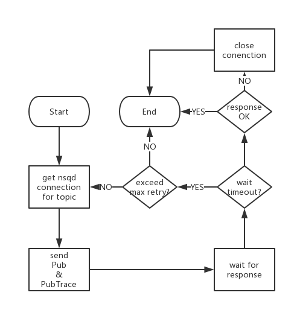
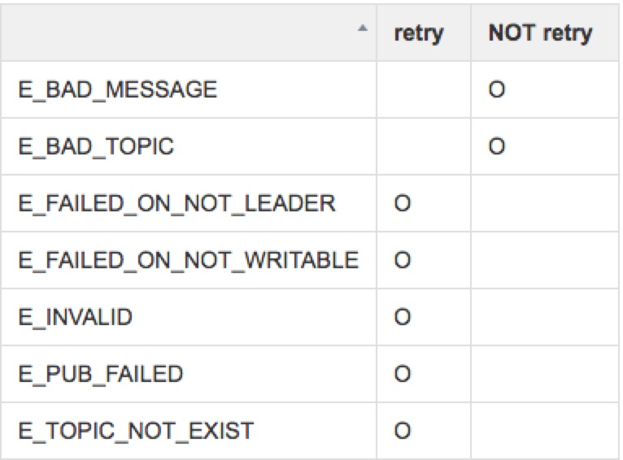
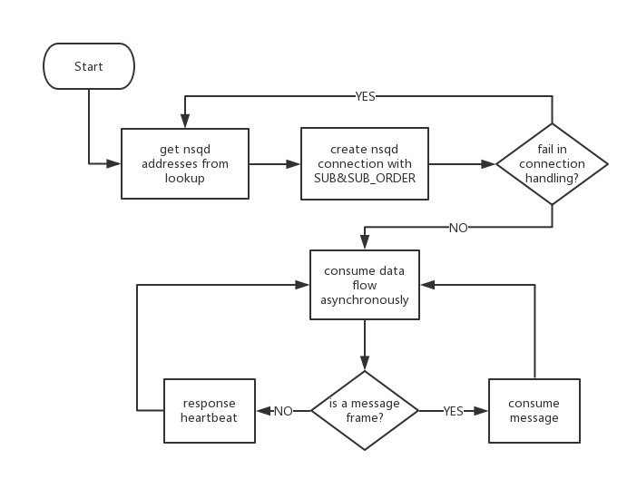
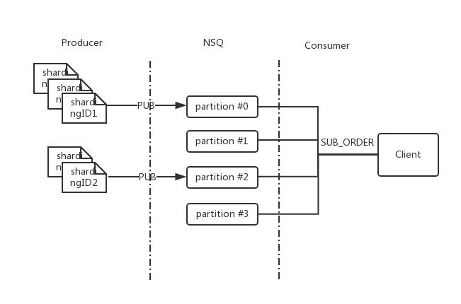

## Overview
As redesigned NSQ in youzan shipped with new features like HA and load balance, partition and replica are introduced in redesigned nsqd. Replications of each partition kept in different nsqd nodes for disaster tolerant purpose. Asides, redesigned NSQ extends existing Protocol Spec to support partition-based message consumption&production, partition-based ordered consumption and message tracing.

In order to make full use of these new functionalities of redesigned NSQ, when we designed a smart client communicating with redesigned NSQ, extra design addressed to make new nsq client cooperate well with redesigned NSQ and the original. As an extension of ["Building Client Libraries"](http://nsq.io/clients/building_client_libraries.html) in [nsq](http://nsq.io) document, this article provides guidelines and considerations on how to design a new smart client, which hereinafter to be referred as client.

Article represents in following 5 parts
1. Client workflow and Configuration
2. Nsqd discovery service
3. Nsqd connection handling
4. Message production/consumption
5. Ordered message consumption & message trace
>Before continue to the rest of this article, we assume that reader is familiar with workflow of a nsq client, and nsq server. If not, we recommend a quick view of ["Building Client Libraries"](http://nsq.io/clients/building_client_libraries.html) as a start point, before continue.

## Client workflow and Configuration
 

First, let's take a glace at the workflow of client through a diagram. As diagram indicates, after client kicks off as message producer/consumer, lookup component requests lookup services to discover nsqd nodes in cluster and returns them to client for connection handling. Client then works on making a connection to these nsqd following protocol spec and exception handling, if there is any. When a TCP connection to nsqd established, producer sends message via kinds of PUB command, consumer listens to TCP connection and process message asynchronously. Both of producer and consumer need to response to heartbeat validation to keep TCP connection alive. Upon the end of message production/consumption, client signals lookup component to stop and closes nsqd connections. Following this flow, we cover details in upcoming parts.

### Client configuration
As to configuration, configuration part from ["Building Client Libraries"](http://nsq.io/clients/building_client_libraries.html) applies to redesigned client but lookup discovery. What need address is that, in original NSQ, client connects to a nsqd in two way: 1. direct connecting to nsqd port; 2. discover nsqd via nsqlookupd. As in redesigned NSQ, leader switches among nsqd nodes for one partition of one topic, which make direct connection to nsqd not feasible for redesigned NSQ. Leader nsqd info for specified topics maintained in nsqlookupd and accessed by client via lookup service, and lookup service is the only option for redesigned NSQ client. Hence our client needs lookup component to access and maintain lookup info from nsqlookupd.

## Nsqd discovery service         
Nsqlookupd works as tool to discover nsqd nodes in cluster for producers and consumers. As what is mentioned above, nsqlookupd acts as standard entrance for finding nsqd. Client requests lookup service at intervals of configurable time elapse. Client manages connection to nsqd returned in lookup response.

Requesting a lookup to nsqlookupd basically follows the way in original nsqlookupd. Besides GET /lookup?topic={topic_name} to http port of nsqlookupd, two extra parameters imported to support access control and topic partition:
<pre>GET：/lookup?topic={topic_name}&access={r|w}&metainfo=true</pre>

param "access" used for telling wether client stands for producer(w) or consumer(r). Nsqlookupd returns nodes which marked as "writable" for request with "access=w", and "readable" for request with "access=r". Another "metainfo" param indicates nsqdlookupd to contain topic partition meta data in lookup response, including total number of topic partition, and replica number. Topic meta data info applies to message ordered production and consumption scenario, in which client producer uses partition meta info to tell if nsqd nodes info from nsqlookupd is complete. As to message ordered consumption, it will be covered later, what we need to address here is that, only lookup request representing producer need metainfo attached.

* Producer GET:/lookup?topic=test&access=w&metainfo=true
* Consumer GET:/lookup?topic=test&access=r

This is due to consideration that meta info serves message order production only at this moment. Lookup request from consumer client does not need to carry metainfo param. Following shows the lookup response from redesigned nsqlookupd:
<pre>
{
    "status_code":200,
    "status_txt":"OK",
    "data":{
        "channels":[
            "BaseConsumer"
        ],
        "meta":{
            "partition_num":1,
            "replica":1
        },
        "partitions":{
            "0":{
                "id":"127.0.0.1:33122",
                "remote_address":"127.0.0.1:33122",
                "hostname":"test-sqs4",
                "broadcast_address":"127.0.0.1",
                "tcp_port":4150,
                "http_port":4151,
                "version":"0.3.7-HA.1.5.4.1",
                "distributed_id":"127.0.0.1:4250:4150:338437"
            }
        },
        "producers":[
            {
                "id":"127.0.0.1:33122",
                "remote_address":"127.0.0.1:33122",
                "hostname":"qabb-qa-sqs4",
                "broadcast_address":"127.0.0.1",
                "tcp_port":4150,
                "http_port":4151,
                "version":"0.3.7-HA.1.5.4.1",
                "distributed_id":"127.0.0.1:4250:4150:338437"
            }
        ]
    }
}
</pre>
Client should be able to parse both lookup responses from redesigned nsqlookupd and the original, for compatibility purpose.

### Lookup process
Lookup process shows bellow:
                       
Nsqlookupd shipped with listlookup service to discover nsqlookupd in cluster. In redesigned NSQ, multi nsqlookupd resides, among which one master is responsible of balancing data flow among nsqd nodes. The others which are slaves, provide lookup service. Client first requests listlookup to configured nsqlookupd http address and get all nsqlookupd. If list lookup fails, client could continue the process, with original configured lookup address.Client walk through all nsqlookupd addresses and request lookup response。 Client merges ALL nsqd lookup responses and maintain.Upon the failure on listlookup or lookup(connection timeout), client could retry. For one lookup address, if access failure exceeds specified value, priority of accessing that lookup address may decrease. Client repeats lookup process at specified interval to keep sync with nsqd nodes.

## Nsqd Connection Handling     
Redesigned nsqd client manages nsqd connection based on [process](http://nsq.io/clients/building_client_libraries.html#connection_handling) described in ["Building Client Libraries"](http://nsq.io/clients/building_client_libraries.html).
 
>* the magic identifier
>* an IDENTIFY command (and payload) and read/verify response
>* a SUB command (specifying desired topic) and read/verify response
>* an initial RDY count of 1

Client try connecting to nsqd partition node according to lookup response. In redesigned NSQ, messages for one topic stores in partitions. Client connect to each partition with {broadcast\_address}:{tcp\_port}. In order for client to publish/consume message to/form all partitions, one TCP connection needs to associate with one partition for target topic.
For MAGIC and IDENTIFY command, there is no difference between original NSQ and redesigned NSQ. After OK response for identify received, client sends subscribe or publish command, based on role client represents. For subscribe, client subscribe to nsqd partition by extended SUB command, with extra topic partition#:
<pre>
SUB &lt;topic&gt; &lt;channel_name&gt; &lt;topic_partition&gt; \n
topic_name -- topic name for consumption
topic_partition -- topic partition
channel_name -- channel to subscribe
</pre>
Response:
<pre>
OK
</pre>
Error response:
<pre>
E_INVALID
E_BAD_TOPIC
E_BAD_CHANNEL
E_SUB_ORDER_IS_MUST  //new in redesigned NSQ
</pre>   
As mentioned above, client as consumer need to subscribe to each partition, if a error response received, client should close connection and return error message to user. When OK response received, client sends RDY command then connection is ready to received message and heartbeat for consumption.

As to producer, when OK response received as response to IDENTIFY, producer could send message to nsqd partition, by extended publish command:

<pre>
PUB &lt;topic_name&gt; &lt;topic_partition&gt;\n
[ 4-byte size in bytes ][ N-byte binary data ]

topic -- topic name for publish
topic_partition -- topic partition for publish
</pre>
Response:
<pre>
OK
</pre>
Error response:
<pre>
E_INVALID
E_BAD_TOPIC
E_BAD_MESSAGE
E_PUB_FAILED
E_FAILED_ON_NOT_LEADER    //new in redesigned NSQ
E_FAILED_ON_NOT_WRITABLE  //new in redesigned NSQ
E_TOPIC_NOT_EXIST         //new in redesigned NSQ
</pre>
Topic partition parameter added in extended sub and pub command. If any error message responses, one error handling way could be: client closes connection, notifies lookup component to update expired lookup in lookup component. Client could retry connecting after lookup info refreshed. Some new error responses introduced in redesigned NSQ for publish and consume. For new error responses in publish command, E\_FAILED\_ON\_NOT\_LEADER means current nsqd client is writing to is not leader of target topic. E\_FAILED\_ON\_NOT\_WRITABLE means current nsqd client is not allowed to write message into. E\_TOPIC\_NOT\_EXIST means topic to which client is trying to write does not exist. Subscribe error will be detailed in message order consumption. Producer publishes to any partition, and client could apply policy like round-robin or so to pick one partition connection to send message.

>There are some other error responses, client is not expected to close connection when they are received. Refer to [A Brief Interlude on Errors](http://nsq.io/clients/building_client_libraries.html#a-brief-interlude-on-errors)  

## Message Production/Consumption
In this part, we talk about how client handles message consumption and message production.

### Client as producer
Message production flows as follow:
                                   
As there is synchronization between publish command and nsqd response, client needs to wait for response and parse it. In first stage of publish, client get nsqd connection for target topic. Nsqd connections could be established and kept in a pool for reuse purpose, with nsqd identification as key.
Once response returned, client need to handle it according to response code. Normally pub command ends with response OK. In that case, client returns connection back to pool and process ends. As error response, retry applies varies with error type, table below provided as reference. Basically, if there is problem in message body to send, there is no need to retry. As to errors like E\_FAILED\_ON_NOT\_LEADER or E\_FAILED\_ON\_NOT\_WRITABLE, client is expected to retry with lookup info refreshed. 

  
### Client as consumer
Message consumption flow as follow:
  
Client creates TCP connections to all nsqd nodes response for lookup request. After nsqd connections established, asynchronous message handling needed for client. Client is expected to provide message handler or callback to handle message flow. Message push from nsqd to client consumer is expected to be consumed within message timeout(60s by default) and send FIN as acknowledgement.

As heartbeat frame received at specified interval, clients are expected to respond to heartbeats from the nsqd instances they’re connected to, by sending NOP frame. More details are covered in [Data Flow and Heartbeats](http://nsq.io/clients/building_client_libraries.html#data-flow-and-heartbeats). According to 4 steps described in [Message Handling](http://nsq.io/clients/building_client_libraries.html#message-handling), for message consumption, there are a few scenario:
> 1. The handler indicates that the message was processed successfully.
> 2. The handler indicates that the message processing was unsuccessful.
> 3. The handler decides that it needs more time to process the message.
> 4. The in-flight timeout expires and nsqd automatically re-queues the message.

### Message acknowledgement
Redesigned NSQ acknowledges to message by sending FIN command with message ID. Message ID is modified in redesigned NSQ, through message ID is still 16-byte. Heigh 8 bytes in big endian is internal ID for NSQ. Low 8 bytes in big endian is traceID, which used for message tracing in redesigned NSQ.
<pre>[8-byte internal id][8-byte trace id]
</pre>

## Ordered Message Consumption     
Topic partition based ordered message consumption, as new functionality in redesigned NSQ, allows producer send message to specified partition. For ordered consumption, in connection handling, new command SUB_ORDER sent after IDENTIFY. In ordered message consumption, one topic partition will not push another message to client, until current in-flight message is acknowledged. Client could treat it like RDY is fixed as 1, and any RDY from client is ignored by nsqd. A ordered topic could not be subscribed with nsqd SUB\_ORDER command. When that happens, E\_SUB\_ORDER\_IS\_MUST error response returned to client.

### Production in ordered message scenario
Client is expected to use sharding ID and associate message of same sharding ID to same topic partition. Topic partitions info is retrieved via metainfo in lokup response. Client as producer maps message to partition and keep it consistent: messages with same sharding ID go through same partition. When target partition is unavailable, client ends publishing and return error, also lookup is expected to refresh.

### Consumption in ordered message scenario
Client as consumer needs to send SUB_ORDER to all nsqd partitions. As nsqd always pushes one message when message consumption fails or timeout, client is expected to keep a log of message whose attempt exceeds threshold. In ordered consumption scenario, as order is addressed, client should not skip a "blocked message" by acknowledging it and send it back to nsqd. Policy need to be specified by message handler. A SUB\_ORDER specifies topic name, channel name, with extra param to partition number:
<pre>SUB_ORDER &lt;topic_name&gt; &lt;channel_name&gt; &lt;topic_partition&gt;\n
topic_name -- topic name to subscribe
channel_name -- channel name
topic_partition -- topic partition to subscribe
</pre>
The messages pump via SUB_ORDER as extension in format, meta info regarding position in queue are contained before message content body. Here is the format, and header part is omitted:
<pre>[x][x][x][x][x][x][x][x]...
|| binary message body
|| [8-byte disk queue offset][4-byte disk queue data size][message body]
</pre>

As both disk queue offset and internal ID mentioned in last part keep increasing in value, client as consumer is expected to use them to validate if messages are received in the order them posted to nsqd.

## Message Tracing
With tracing ID in message ID and new PUB_TRACE command, redesigned NSQ is capable of tracing message lifecycle. To trace a message, client send message with PUB\_TRACE:
<pre>PUB_TRACE &lt;topic_name&gt; &lt;topic_partition&gt;\n
[ 4-byte size in bytes ][8-byte size trace id][ N-byte binary data ]
</pre>
PUB\_TRACE has traceID contained in body，and trace ID receives 64-bit unsigned integer as valid value. Successful response from NSQ to PUB\_TRACE is：
<pre>OK(2-bytes)+[8-byte internal id]+[8-byte trace id from client]+[8-byte internal disk queue offset]+[4 bytes internal disk queue data size]
</pre>
Client is expected to allow user to turn on/off message tracing, with client dynamic configuration. Also, client is expected to print trace log in client side for message publish and consume when tracing is on. Some message meta info is expected to log. For producer, they are <pre>
internal ID
trace ID
disk queue offset
</pre>
And for consumer, there is no particular new subscribe command for tracing, client is expected to log message meta info, based on the subscribe command type. 
<pre>internal ID
disk queue offset(for SUB_ORDER)
disk queue data size(for SUB_ORDER)
timestamp
consumer local IP
nsqd remote IP
</pre>

## Conclusion
In this article, we talk about new features in redesigned NSQ and emphasize on how to build a client to communicate with these features. There is NSQ client in reference we contribute as code base, which supports topic partition and lookup query. 
## Reference
* [1] NSQ TCP Protocol Spec:http://nsq.io/clients/tcp\_protocol_spec.html
* [2] Building Client Libraries:http://nsq.io/clients/building\_client\_libraries.html
* [3] NSQ-Client-Java in youzan:https://github.com/youzan/nsqJavaSDK
* [4] NSQ in youzan:https://github.com/absolute8511/nsq                       
